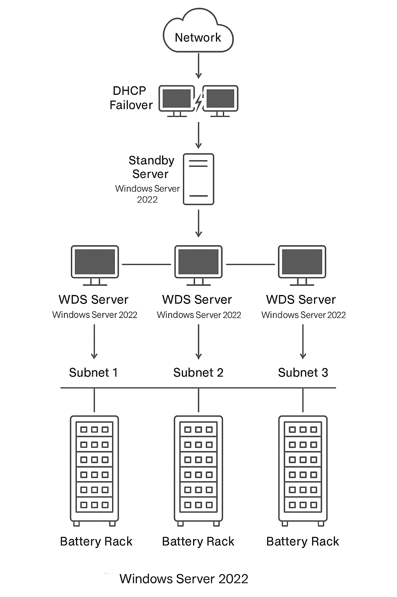
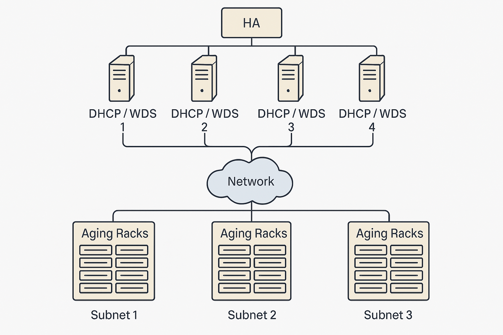

# **豆包**

为实现服务器自动切换，优化网络架构需从**DHCP高可用性**、**WDS负载均衡与数据同步**、**备用服务器角色重构**三方面入手，结合Windows Server内置功能与网络配置策略，具体方案如下：

### **一、DHCP服务高可用性优化（自动故障转移）**
#### **目标**：避免手动切换DHCP服务器，实现子网内DHCP服务自动接管。  
#### **方案**：  
1. **为每个子网配置DHCP故障转移对**  
   - 将现有3台主服务器（Server A/B/C）与1台备用服务器（Server D）组成**一对一故障转移组**：  
     - **子网1**：Server A（主） + Server D（备）  
     - **子网2**：Server B（主） + Server D（备）  
     - **子网3**：Server C（主） + Server D（备）  
   - 通过Windows Server内置的 **DHCP故障转移** 功能配置：  
     - 在主服务器上右键点击“DHCP作用域”→“配置故障转移”，选择“热备用”模式，指定备用服务器IP，同步作用域数据。  
     - 备用服务器平时处于“待机”状态，主服务器故障时自动接管DHCP服务（切换时间通常<1分钟）。  

2. **优势**  
   - 无需手动修改IP或服务配置，故障转移完全自动化。  
   - 备用服务器（Server D）可同时为3个子网提供DHCP备用，节省硬件资源。

### **二、WDS服务负载均衡与数据同步**
#### **目标**：确保PXE客户端自动切换WDS服务器，避免单点故障。  
#### **方案**：  
1. **多WDS服务器负载均衡**  
   - 在每个子网的**DHCP选项**中配置多个WDS服务器地址（支持主备或多活）：  
     - **DHCP选项66**（引导服务器主机名/IP）：填写主WDS服务器（Server A/B/C）和备用WDS服务器（Server D）的IP，用逗号分隔（如 `192.168.1.10,192.168.1.20`）。  
     - **DHCP选项67**（启动文件名）：统一为 `pxeboot.com` 或 `boot\x64\wdsmgfw.efi`（根据UEFI/BIOS模式调整）。  
   - **原理**：PXE客户端按顺序尝试连接DHCP指定的WDS服务器，主服务器故障时自动尝试下一个IP。  

2. **WDS映像文件同步**  
   - 使用 **DFS（分布式文件系统）复制** 同步所有服务器（A/B/C/D）的WDS映像目录（默认路径：`C:\RemoteInstall`）：  
     - 创建DFS复制组，将4台服务器加入同一复制组，配置实时或定时同步策略。  
     - 确保备用服务器（Server D）的WDS服务已预安装并指向同步后的映像目录，无需手动复制文件。  

3. **WDS服务高可用性配置**  
   - 在每台服务器（A/B/C/D）上启用WDS服务，配置相同的引导策略（如响应所有PXE客户端）。  
   - 主服务器故障时，客户端通过DHCP选项自动连接备用服务器的WDS服务，无需人工干预。

### **三、网络架构与备用服务器角色重构**
#### **1. 子网与IP规划调整**  
- **保留3个子网划分**（原因为带宽限制），但调整备用服务器的网络接入：  
  - Server D需同时接入3个子网（或通过VLAN路由），确保能为每个子网提供DHCP和WDS服务。  
  - 建议为Server D配置多块网卡（或虚拟网卡），每个子网分配独立IP，避免跨子网路由延迟。  

#### **2. 备用服务器（Server D）功能定位**  
- **DHCP备用角色**：作为3个子网DHCP作用域的故障转移伙伴，通过Windows DHCP故障转移机制自动接管。  
- **WDS通用备用角色**：通过DFS同步所有子网的WDS映像，作为所有子网的备用WDS服务器，通过DHCP选项66被客户端访问。  

#### **3. 故障转移验证流程**  
- **模拟主服务器故障**：关闭Server A（子网1主服务器），观察Server D是否自动接管子网1的DHCP服务（可通过客户端获取IP验证）。  
- **验证PXE引导**：子网1客户端重启后，应通过Server D的DHCP获取IP，并尝试连接Server D的WDS服务完成系统安装。  

### **四、优化后架构优势**  
1. **全自动故障转移**：DHCP服务通过Windows内置机制自动切换，WDS服务通过DHCP选项轮询和DFS同步实现无感知切换，无需人工干预。  
2. **资源高效利用**：1台备用服务器（Server D）同时为3个子网提供冗余，减少硬件成本。  
3. **高扩展性**：未来新增子网时，只需扩展DHCP作用域和WDS映像同步，无需重构架构。  
4. **简化管理**：集中通过DFS管理WDS映像更新，避免多服务器手动同步的复杂性。

### **五、注意事项**  
- **DNS配置**：确保所有服务器的DNS解析正常，建议使用静态IP和DNS注册。  
- **防火墙设置**：开放DHCP（UDP 67/68）、WDS（UDP 67/68, TCP 69, 4011）相关端口，确保跨服务器通信。  
- **性能测试**：在高负载下验证DFS复制延迟，建议采用高速局域网（如10Gbps）或优化复制计划（如非高峰时段增量同步）。  

通过以上优化，可实现老化架PXE部署的服务器自动切换，大幅提升系统可靠性与管理效率。

# **ChatGPT**

谢谢提供详细信息。我将研究如何在使用Windows Server 2022、无共享存储、无需第三方软件的前提下，优化PXE/WDS部署架构，以实现DHCP/WDS服务器在不同子网间的自动切换机制。
我会评估适合的高可用方案，包括Windows原生功能如故障转移群集（Failover Clustering）、DHCP故障转移配置、以及如何配置WDS服务的冗余与自动恢复，并提供适配你当前网络架构的优化建议。

# DHCP 高可用设计

可利用 Windows Server 自带的 **DHCP 故障转移** 功能，将每个子网的 DHCP 范围与备用服务器结成主备伙伴关系，实现自动同步和接管。配置时为主服务器和备用服务器创建故障转移关系，将所有作用域加入该关系，Windows 将自动复制租约和配置。常用 **热备用（Hot Standby）** 模式下，主服务器负责为客户端分配地址，备用服务器仅在主服务器不可用时才接管发放租约。例如，可对每个子网分别与备用服务器建立故障转移关系，备用服务器应在对应子网中具有相应的网卡和作用域定义。这样，当主 DHCP 服务宕机时，备用服务器即可自动激活为主，用于继续分配 IP。若希望双活负载，也可采用负载均衡模式，但在只有一台备用服务器的场景下，热备用模式更为简单直接。无论哪种模式，都应保持故障转移关系配置开启并定期检测状态，以确保主备之间的租约信息实时同步。

# WDS 多点部署与镜像同步

Windows 部署服务 **不支持传统集群**，但可通过部署多台 WDS 服务器来实现容错和负载均衡。官方建议至少部署两台 WDS 服务器来提高可用性。在当前三子网架构中，可在每个子网各部署一台 WDS（即已有的主服务器），并在备用服务器上安装相同的 WDS 角色。关键是**保持所有 WDS 的映像库内容一致**。推荐使用 Windows **DFS 复制（DFSR）** 来同步 `RemoteInstall\Images` 目录或使用 DFS 命名空间管理映像库。例如，可创建一个 DFS 复制组，将三台主 WDS 与备用 WDS 的映像文件夹都加入该组，确保任何主服务器上镜像的更新都会自动复制到其他节点。这样备用 WDS 时刻拥有最新的引导映像和安装映像。部署时还要确保所有 WDS 均配置为**响应所有 PXE 请求**（在 WDS 管理控制台的“启动”选项卡中设置 “Answer clients: All”）。必要时，可配置 DHCP Option 66/67 或 Option 60，以便 PXE 客户端在请求时能定位到正确的 WDS 服务器。通过上述方式，若任一 WDS 宕机，其它节点仍然可以接管网络部署工作，达到“主机不可用时自动转到其他 WDS” 的效果。

# 自动化故障切换流程

DHCP 故障转移本身可以自动切换，主服务器宕机后备用会自动激活并分配 IP；但 WDS 服务切换缺乏一键机制，需要配合脚本或任务计划减少人工干预。可以编写 PowerShell 脚本自动化切换步骤：例如，利用 `Set-DhcpServerv4Failover` 或 `Get-DhcpServerv4Scope | Set-DhcpServerv4Scope` 等命令调整故障转移状态；在需要时使用 `Set-DhcpServerv4OptionValue` 更新 DHCP 的引导服务器地址（Option 66）指向备用 WDS；使用 `WDSUTIL /Set-Server /AnswerClients:All` 等命令在备用机上启用 PXE 响应。可将这些脚本设置为任务计划任务，当监测到主服务器宕机或 WDS 服务停止的事件时自动触发执行。另一个思路是使用 DNS 别名：为 WDS 服务创建一个 DNS 名称（如 `wds.contoso.local`），平时指向主服务器 IP，主机故障时只需将别名指向备用服务器的 IP，无需更改客户端配置。通过这样的预置脚本和自动化措施，即使无法实现完全透明的自动切换，也可在故障发生时快速切换环境，最大程度减少人工操作。

\*\*总结建议：\*\*在现有环境下，使用 Windows 原生功能构建 DHCP 和 WDS 高可用系统。一方面，对所有 DHCP 范围启用故障转移（推荐热备用模式），备用服务器预先配置好各范围作用域并加入故障关系，以实现租约数据实时同步和自动接管。另一方面，多台 WDS 服务器共享相同映像库（通过 DFS 复制）来保证镜像一致性，并设置 WDS 自动响应 PXE 请求。在此基础上，结合 PowerShell 脚本和任务计划（或 DNS 别名），实现故障发生时的快速切换，从而在满足网络带宽和安全要求的前提下，大幅提高 PXE/WDS 服务的可用性和自动化程度。

\*\*参考资料：\*\*Windows DHCP 故障转移文档；Windows 部署服务高可用性和 DFS 复制文档。

