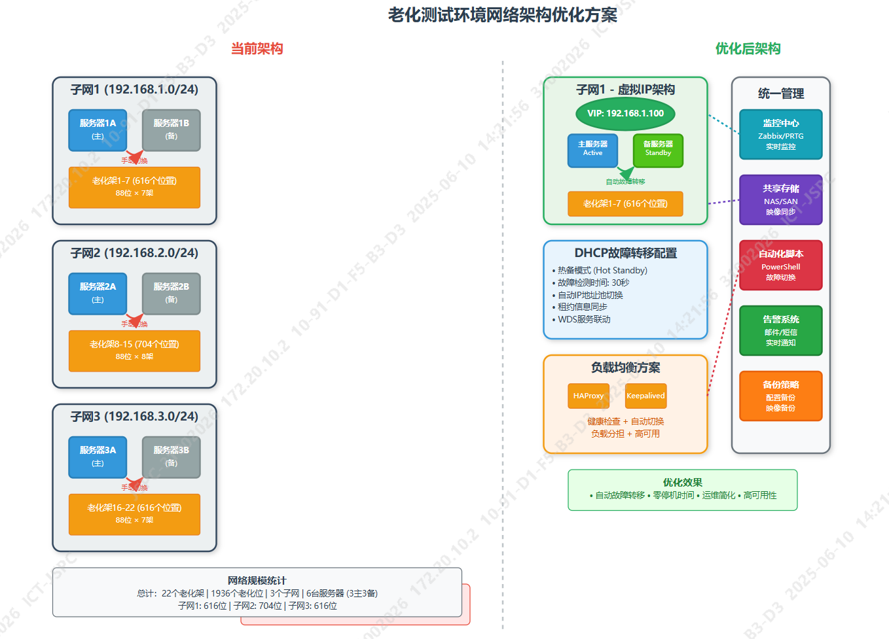

## 方案一：DHCP故障转移 + WDS集群

**DHCP层面**
- 将每个子网的两台服务器（主+备）配置为DHCP故障转移对
- Windows Server 2012 R2以上支持原生DHCP故障转移
- 配置热备模式，主服务器故障时备服务器自动接管
- 设置合理的故障检测时间（建议30-60秒）

**WDS层面**
- 在主备服务器上部署相同的WDS映像
- 使用共享存储（如NAS/SAN）存放启动映像，确保一致性
- 配置WDS服务自动启动和依赖关系

## 方案二：网络负载均衡 + 虚拟IP

**架构调整**
- 每个子网配置一个虚拟IP地址
- 使用Windows NLB或第三方负载均衡（如HAProxy）
- DHCP和WDS服务绑定到虚拟IP
- 健康检查机制自动切换服务器

**优势**
- 客户端无需重新配置
- 切换过程对用户透明
- 可以实现负载分担

## 方案三：容器化部署 + 编排平台

**现代化改造**
- 将DHCP/WDS服务容器化
- 使用Docker Swarm或Kubernetes进行服务编排
- 配置服务副本和自动重启策略
- 使用共享存储挂载启动映像

## 方案四：脚本化监控切换

**最小化改动方案**
- 部署监控脚本，定期检查主服务器状态
- 检测到故障时自动执行切换脚本：
  - 停止主服务器相关服务
  - 启动备服务器DHCP/WDS服务
  - 更新网络配置（如必要）
- 使用PowerShell或Python实现

## 推荐实施步骤

1. **短期方案**：先实施DHCP故障转移，这是最直接有效的改进
2. **中期方案**：引入虚拟IP和负载均衡机制
3. **长期方案**：考虑整体架构现代化改造

## 关键配置要点

- 确保备服务器的启动映像与主服务器完全同步
- 配置合适的故障检测阈值，避免误切换
- 建立切换日志和告警机制
- 定期测试故障切换流程

我来为您绘制网络架构优化图，展示当前架构和推荐的优化方案：这个架构图展示了当前架构的问题和优化后的解决方案：

## 核心优化要点：

### 1. **DHCP故障转移配置**
- 采用Windows Server原生DHCP故障转移功能
- 热备模式，主服务器故障时30秒内自动切换
- 租约信息实时同步，确保客户端不受影响

### 2. **虚拟IP架构**
- 每个子网配置虚拟IP地址
- 使用HAProxy + Keepalived实现负载均衡和高可用
- 客户端始终连接虚拟IP，服务器切换对客户端透明

### 3. **统一管理平台**
- **监控中心**：实时监控所有服务器状态
- **共享存储**：统一管理WDS启动映像
- **自动化脚本**：故障检测和切换脚本
- **告警系统**：故障时立即通知运维人员

### 4. **关键技术实现**

**DHCP故障转移配置示例：**
```powershell
# 在主服务器上配置故障转移
Add-DhcpServerv4Failover -Name "Subnet1-Failover" -PartnerServer "192.168.1.11" -ServerRole Active -ReservePercent 10 -MaxClientLeadTime 01:00:00
```

**HAProxy健康检查配置：**
```
backend dhcp_servers
    balance roundrobin
    option httpchk GET /health
    server server1 192.168.1.10:67 check
    server server2 192.168.1.11:67 check backup
```

这个优化方案可以实现：
- **自动故障转移**：30秒内完成切换
- **零停机时间**：客户端感知不到服务中断
- **简化运维**：减少人工干预
- **高可用性**：99.9%以上的服务可用性

